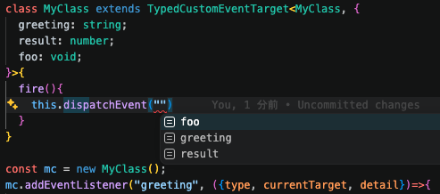
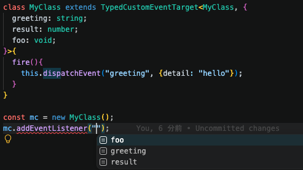
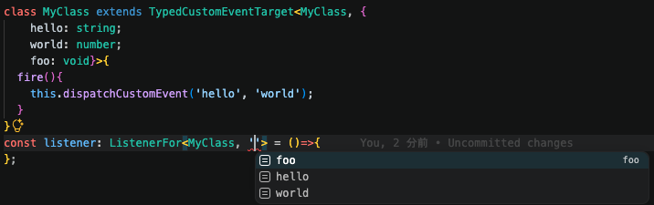
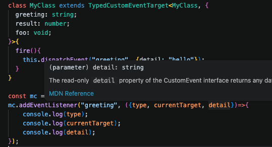
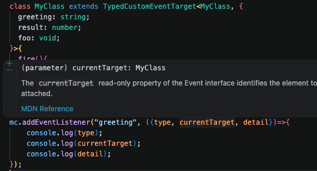
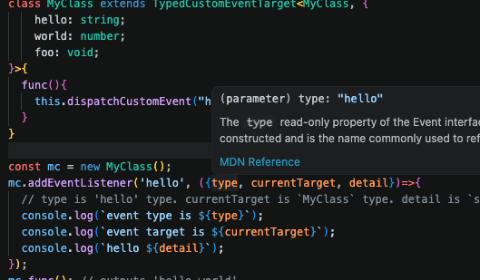

[English](README.md) 日本語

# TypedCustomEventTarget(tcet).

強く型付けされた [EventTarget](https://developer.mozilla.org/en-US/docs/Web/API/EventTarget)、`TypedCustomEventTarget` とその関連クラス群を含んだライブラリです。
イベントの`type`, `currentTarget` と `detail` フィールド、
イベントターゲットの`addEventListener`, `removeEventListener`, と `dispatchEvent` メソッドにイベント定義に応じた型や制約が追加されます。

静的ビルドで生成される[es形式のJavaScriptコード](./dist/tcet.es.js)は、242bytesのみです。

[](https://www.npmjs.com/package/tcet)
[](https://github.com/takawitter/tcet/blob/master/LICENSE)

## 簡単な使い方

```bash
npm i tcet
```

イベントを発生させるクラスで `TypedCustomEventTarget` を継承して、自身の型とイベント定義(イベント名とdetailの型のマップ)を型パラメータに渡してください。
すると、`dispatchEvent` や `addEventListener` などのメソッドが、それに渡すリスナーにまで型情報が付与された状態で定義されます。

```ts
class MyClass extends TypedCustomEventTarget<MyClass, {greeting: string}>{
  fire(){
    // 第一引数は'greeting'のみ。第二引数のdetailはstring型のみ。
    this.dispatchEvent('greeting', {detail: 'hello'});
  }
}

const mc = new MyClass();
mc.addEventListener('greeting', ({type, currentTarget, detail})=>{
  // typeは'hello'型, currentTargetは `MyClass`型, detailは `string`型
  console.log(`${detail}`);
});
mc.fire(); // 'hello' が出力される。

// リスナーを独立して定義するときは、`ListenerFor` を使うと便利です。
const listener: ListenerFor<MyClass, 'greeting'> = ({detail})=>{
  console.log(`${detail}`);
};
mc.addEventListener('greeting', listener);
mc.removeEventListener('greeting', listener);
```

## コード補完とタイプヒントの例

### dispatchEvent



### addEventListener



### ListenerFor



### detail field of event



### currentTarget field of event



### type field of event



## 型チェック例

```ts
class MyClass extends TypedCustomEventTarget<MyClass, {greeting: string, foo: void}>{
  fire(){
    this.dispatchEvent("greeting", {detail: "hello"});  // OK
    this.dispatchEvent("greeting", {detail: "hello", cancelable: true});  // OK
    this.dispatchEvent("greeting");  // NG
    this.dispatchEvent("foo");  // OK
    this.dispatchEvent("foo", {cancelable: true});  // OK
    this.dispatchEvent("bar");  // NG
    this.dispatchEvent(new Event("greeting", {detail: "hello"}));  // NG
    this.dispatchEvent(new CustomEvent("greeting", {detail: "hello"}));  // NG
    this.dispatchEvent(new TypedCustomEvent("greeting", {detail: "hello"}));  // OK
    this.dispatchEvent(new TypedCustomEvent("greeting"));  // NG
    this.dispatchEvent(new TypedCustomEvent("foo", {cancelable: true}));  // OK
    this.dispatchEvent(new TypedCustomEvent("foo"));  // OK
  }
}
const mc = new MyClass();
const gl: ListenerFor<MyClass, "greeting"> = ({detail})=>{
    console.log(detail);
};
const fl: ListenerFor<MyClass, "foo"> = ()=>{};
mc.addEventListener('greeting', gl);  // OK
mc.addEventListener('foo', gl);  // NG
mc.addEventListener('bar', fl);  // NG
mc.addEventListener('foo', null);  // OK
```

## 特徴

TypeScriptの `EventTarget` をベースに、以下の拡張を行っています。

* イベントターゲットのベースクラス `TypedCustomEventTarget<T, Events>` が追加されています。これは [EventTarget](https://github.com/microsoft/TypeScript-DOM-lib-generator/blob/main/baselines/dom.generated.d.ts#L11854) を継承したクラスで、`T` はイベントターゲットのクラス、`Events` はイベント名とイベント発生時の詳細情報を定義したクラスです。以下のメソッドを持ちます。
  * `addEventListener` と `removeEventListener`。特定のイベントを受け取るリスナを追加または削除します。`TypedCustomEventTarget`に渡された `Events` 内の定義毎にオーバーロードが定義されます。(種類毎のオーバーロード定義は、既存のライブラリ [typescript-event-target](https://www.npmjs.com/package/typescript-event-target) でも使われている手法です)
  * `dispatchEvent(type: K, eventInitDict: CustomEventInit<D>)`。イベントのディスパッチを行うメソッドです。`TypedCustomEventTarget` に渡された `Events` 内の定義毎にオーバーロードが定義されます。イベントは `Events` 内で `K: D` の形式で定義でき、`K` がイベント名、`D` がイベントの詳細情報を格納する型です。(詳細は利用例を参照)
* イベント `TypedCustomEvent<T, K>` は [CustomEvent&lt;D&gt;](https://github.com/microsoft/TypeScript-DOM-lib-generator/blob/main/baselines/dom.generated.d.ts#L8830)を継承したクラスで、`T` はイベントターゲットのクラス、`K` はイベント名を表します。以下のフィールドを持ちます。
  * `type`。型は `K` になります。
  * `currentTarget`。型はイベントターゲットのクラスである `T` です。
  * `detail`。型はイベントの詳細情報を定義するクラス `D` です。これはベースクラスの `CustomEvent<D>` による型付けです。`T` の定義から `K` に対応したイベントの詳細の型を取り出し、`CustomEvent<D>` のパラメータ `D` に与えています。 

tcetの導入により追加されるJavaScriptコードは、`TypedCustomEvent`, `TypedCustomEventTarget` の名前と、 `TypedCustomEventTarget.dispatchEvent`メソッドの実装のみで、es形式で242バイトです。他はコンパイル時の型チェックに使われる定義のみで、静的ビルド時に生成されるコードのサイズには影響しません。

## Example 1

### イベントの定義

```ts
interface MyClassEvents{
  notify1: string;
  notify2: number;
}
```

`notify1` と `notify2` がイベント名で、それぞれの詳細情報の型は `string` と `number` です。

### イベントターゲットの定義
```ts
import { TypedCustomEventTarget } from "tcet";

class MyClass extends TypedCustomEventTarget<MyClass, MyClassEvents>{
  f1(){
    // `dispatchEvent` を呼ぶと、イベントを発生させられます。
    // これは `dispatchEvent(new TypedCustomEvent("notify1", {detail: "hello"}))` を実行するのと同じです。
    // tcetによる型付けにより、IDE(VSCode等)でコード補完が効きます。
    this.dispatchEvent("notify1", {detail: "hello"});
  }
  f2(){
    this.dispatchEvent("notify2", {detail: 100});
  }
}
```

### イベントの受け取り
```ts
const mc = new MyClass();
// `addEventListener` ではコード補完が効きます。
mc.addEventListener("notify1", ({currentTarget, detail})=>{
  // `currentTarget`の型は `MyClass` です。`detail`の型は`string`です。
  console.log(detail); // "hello" と出力されます。
});
mc.addEventListener("notify2", ({detail})=>{
  console.log(detail); // 100 と出力されます。
});
```

## Example 2

### イベントターゲットの定義

```ts
import { type ListenerFor, TypedCustomEventTarget } from "tcet";

// イベント定義をインラインで与えることもできます。
class MyClass extends TypedCustomEventTarget<MyClass, {
  hello: {
    message: string;
  }
}>{
  f1(){
    this.dispatchEvent("hello", {detail: {message: "hello"}});
  }
}
```

### イベントリスナの追加と削除

```ts
// イベントリスナを独立して定義する場合には、`ListenerFor`を使用してリスナの型を取り出すと便利です。
// その際、型パラメータに、イベントターゲットの型とイベント名を与える必要があります。
const listner: ListenerFor<MyClass, "hello"> = ({detail: {message}})=>{
  console.log(message);
};
const mc = new MyClass();
mc.addEventListener("hello", listener);
mc.f1();
mc.removeEventListener("hello", listener);
```

### (FYI)イベント関連情報の取得

```ts
type EventsDefinitionOfMyClass = EventsOf<MyClass>; // -> {hello: {message: string}}
type DetailTypeOfHelloEvent = EventDetailOf<MyClass, "hello">; // -> {message: string}
```

`EventsOf<T>`で `T` で定義されたイベントの型の取得、`EventDetailOf<T, K>` で `T` で定義されたイベント `K` の詳細情報の型が取得できます。
